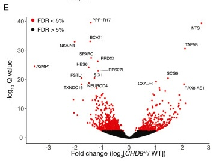

STAT 540 Analysis Assignment
================
<YOUR NAME HERE>

## Link to my assignment repository

Fill in the link to your assignment repository here: [STAT 540 Analysis
Assignment](insert%20link%20here)

## Instructions

- You only need to fill in the code chunks and text where indicated with
  **Exercise \#**.
- When answering the questions, it is not sufficient to provide only
  code. Add explanatory text to interpret your results throughout.
- Make sure to add comments to your code to explain what you are doing
  in each step.

## Academic Integrity

If you use any generative AI tools to complete the assignment, please
provide a brief explanation of how you used them:

1.  What tool(s) did you use (e.g., ChatGPT, Claude, GitHub Copilot)? I
    used ChatGPT to deepen my understanding of concepts taught in class
    and to clarify any questions I had.

2.  How did the tool(s) fit into your workflow? What was input into the
    tool? I asked questions about specific concepts related to the
    course material to better understand them before applying them in my
    work.

3.  What did you receive as output? I received explanations and
    clarifications that helped me grasp the concepts more thoroughly.

4.  Did you modify or verify the output? Yes, I used the explanations to
    enhance my understanding before starting to code, ensuring I had a
    solid grasp of the material.

### Background

The dataset used for this assignment has been published by [Shi et
al. in 2023](https://www.cell.com/ajhg/fulltext/S0002-9297(23)00317-8)
in the American Journal of Human Genetics. You’ll recognize this study,
“Heterozygous deletion of the autism-associated gene CHD8 impairs
synaptic function through widespread changes in gene expression and
chromatin compaction” as the paper you were asked to review for the
Paper Critique assignment. The raw RNA-seq read counts, and binned
ATAC-seq counts for this study are available in GEO.

## Packages required

All of the packages you will need are listed below. If you have never
used them before, you will need to install them using the
`BiocManager::install("<PACKAGE_NAME>")` or
`install.packages("<PACKAGE NAME)` command. Add any additional packages
you find you need for the code you use to answer the questions.

``` r
library(biomaRt)
library(tidyverse)
library(GEOquery)
library(DESeq2)
library(pheatmap)
library(ggrepel)
# use ggplot theme_bw
theme_set(theme_bw())
# set seed for reproducibility
set.seed(3846)
```

## Part 1 - Accessing RNA-seq data using GEOquery

Here we’ll read in the RNA-seq dataset. The RNA-seq read counts are read
in from a compressed `.txt` file, which was obtained from the [GEO
entry](https://www.ncbi.nlm.nih.gov/geo/query/acc.cgi?acc=GSE236993).
The sample metadata is read in with a single line of code using the
`getGEO()` function from the `GEOquery` package.

``` r
# download RNA-seq file 
if(!file.exists("GSE236993.txt.gz")) {
  gzpath <- "https://ftp.ncbi.nlm.nih.gov/geo/series/GSE236nnn/GSE236993/suppl/GSE236993_CHD8_RNAseq_ReadCounts.txt.gz"
  download.file(gzpath, destfile = "GSE236993.txt.gz")
}

# Read in the file
rna <- read.table(gzfile("GSE236993.txt.gz"), header = TRUE, sep = "\t")

# get metadata
metadata <- getGEO("GSE236993", getGPL = FALSE)[[1]] %>% pData()
```

    ## Found 1 file(s)

    ## GSE236993_series_matrix.txt.gz

## Part 2 - Check the data and repackage into a `DESeqDataSet` object

Does the data look as expected? Let’s check the RNA-seq counts first.
How many samples are there? How many genes? What are the column names?
Are there any duplicate gene names?

``` r
# Check first few rows and dimensions
head(rna)
```

    ##       Gene RNA01 RNA02 RNA03 RNA04 RNA05 RNA06 RNA07 RNA08 RNA09
    ## 1     A1BG     0     0     3     1     3     0     4     1     1
    ## 2 A1BG-AS1     0     1     1     5     1     1     3     0     1
    ## 3     A1CF     0     0     0     0     1     1     0     0     1
    ## 4      A2M     0     1     1     4     4     0     8     3     1
    ## 5  A2M-AS1     0     0     0     1     0     1     0     0     0
    ## 6    A2ML1     0    15    11    31    18    21    41     4    21

``` r
dim(rna)
```

    ## [1] 23895    10

``` r
# check number of unique genes
length(unique(rna$Gene))
```

    ## [1] 23893

We notice there are some duplicate gene names. Let’s remove these. Note
that an alternative strategy may be to average the measurements across
duplicate genes, supposing they are measurements of, say, two
transcripts of the same gene. However, then we would not necessarily
have integer counts, which would complicate our DESeq analysis.

``` r
# remove duplicate gene names
rna <- rna[!duplicated(rna$Gene),]
dim(rna)
```

    ## [1] 23893    10

Next, let’s check the RNA-seq metadata. There are quite a lot of columns
in it, so we’ll pull out only the column(s) we need for the analysis.
The title column contains the sample ID and the condition (H66 control
or CHD8 isoform A or B).

``` r
# Check first few columns and dimensions
metadata %>% tibble()
```

    ## # A tibble: 9 × 43
    ##   title              geo_accession status submission_date last_update_date type 
    ##   <chr>              <chr>         <chr>  <chr>           <chr>            <chr>
    ## 1 RNA01_H66_neuron_… GSM7592755    Publi… Jul 10 2023     Jul 12 2023      SRA  
    ## 2 RNA02_H66_neuron_… GSM7592756    Publi… Jul 10 2023     Jul 12 2023      SRA  
    ## 3 RNA03_H66_neuron_… GSM7592757    Publi… Jul 10 2023     Jul 12 2023      SRA  
    ## 4 RNA04_CHD8A_neuro… GSM7592758    Publi… Jul 10 2023     Jul 12 2023      SRA  
    ## 5 RNA05_CHD8A_neuro… GSM7592759    Publi… Jul 10 2023     Jul 12 2023      SRA  
    ## 6 RNA06_CHD8A_neuro… GSM7592760    Publi… Jul 10 2023     Jul 12 2023      SRA  
    ## 7 RNA07_CHD8B_neuro… GSM7592761    Publi… Jul 10 2023     Jul 12 2023      SRA  
    ## 8 RNA08_CHD8B_neuro… GSM7592762    Publi… Jul 10 2023     Jul 12 2023      SRA  
    ## 9 RNA09_CHD8B_neuro… GSM7592763    Publi… Jul 10 2023     Jul 12 2023      SRA  
    ## # ℹ 37 more variables: channel_count <chr>, source_name_ch1 <chr>,
    ## #   organism_ch1 <chr>, characteristics_ch1 <chr>, characteristics_ch1.1 <chr>,
    ## #   characteristics_ch1.2 <chr>, characteristics_ch1.3 <chr>,
    ## #   treatment_protocol_ch1 <chr>, growth_protocol_ch1 <chr>,
    ## #   molecule_ch1 <chr>, extract_protocol_ch1 <chr>,
    ## #   extract_protocol_ch1.1 <chr>, taxid_ch1 <chr>, data_processing <chr>,
    ## #   data_processing.1 <chr>, data_processing.2 <chr>, platform_id <chr>, …

``` r
dim(metadata)
```

    ## [1]  9 43

``` r
# Extract only the columns we need: 
# title - contains the column name from the count matrix, and the condition (H66 control or CHD8 isoform A or B).
# Extract these pieces of information into separate columns
# Rename the H66 Condition to WT (consistent with presentation in the paper)
coldata <- metadata %>%
  select(title) %>%
  separate(title, 
           into = c("ID", "Condition", "Cell Type", "Replicate"), 
           sep = "_", remove = FALSE) %>%
  select(-`Cell Type`) %>%
  mutate(Condition = ifelse(Condition == "H66", "WT", Condition))
coldata
```

    ##                               title    ID Condition Replicate
    ## GSM7592755   RNA01_H66_neuron_brep1 RNA01        WT     brep1
    ## GSM7592756   RNA02_H66_neuron_brep2 RNA02        WT     brep2
    ## GSM7592757   RNA03_H66_neuron_brep3 RNA03        WT     brep3
    ## GSM7592758 RNA04_CHD8A_neuron_brep1 RNA04     CHD8A     brep1
    ## GSM7592759 RNA05_CHD8A_neuron_brep2 RNA05     CHD8A     brep2
    ## GSM7592760 RNA06_CHD8A_neuron_brep3 RNA06     CHD8A     brep3
    ## GSM7592761 RNA07_CHD8B_neuron_brep1 RNA07     CHD8B     brep1
    ## GSM7592762 RNA08_CHD8B_neuron_brep2 RNA08     CHD8B     brep2
    ## GSM7592763 RNA09_CHD8B_neuron_brep3 RNA09     CHD8B     brep3

Here we will repackage the RNA-seq data into a `DESeqDataSet` object.
This object is used in the `DESeq2` package for differential expression
analysis. It is also a handy format that will join together the counts
and the sample metadata. To do so, we first need to match each sample
from the metadata to the columns in count.

``` r
# move gene ids to rownames to convert rna to numeric matrix
rownames(rna) <- rna$Gene
rna <- as.matrix(rna[, -1])

# make sure the column names match the sample names and are in the same order
identical(colnames(rna), coldata$ID)
```

    ## [1] TRUE

``` r
# create a more informative ID that indicates the condition and replicate number
coldata$ID <- paste0(coldata$Condition, "_", coldata$Replicate)
rownames(coldata) <- coldata$ID
colnames(rna) <- coldata$ID
```

Now, we will use the `DESeqDataSetFromMatrix` function to create a
`DESeqDataSet` object. This object will join the count data and the
sample metadata, as well as specify the design formula for the
differential expression analysis. Note that here we will use “~ 0 +
Condition” in the design formula (the cell means parameterization). This
is because we would like to be able to test for differences between
various condition combinations in our analysis (which will use
contrasts).

``` r
# create DESeqDataSet object
dds <- DESeqDataSetFromMatrix(countData = rna,
                              colData = coldata,
                              design = ~ 0 + Condition)
```

    ## Warning in DESeqDataSet(se, design = design, ignoreRank): some variables in
    ## design formula are characters, converting to factors

## Part 3 - Exploratory data analysis (EDA)

Now that we have the data in the right format, let’s do some exploratory
data analysis.

Recall from the published paper that the authors stated that they
analyzed 15,574 genes, but here we have 23893 genes. Let’s first try to
remove any genes with no expression across samples, and see if it
matches their total.

``` r
# remove genes with no expression
dds <- dds[rowSums(counts(dds)) > 0,]
nrow(dds)
```

    ## [1] 16678

OK, a little closer. Perhaps they used a filter like at least 2 samples
with a count of 1?

``` r
# remove genes with mean count less than 1
dds <- dds[rowSums(counts(dds)) >= 2,]
nrow(dds)
```

    ## [1] 15434

We don’t know for sure what their criteria for “undetected” was since it
wasn’t reported, but this is reasonably close so we’ll move on with this
set of genes.

We’ll next look at the distribution of counts across samples.

``` r
# plot the distribution of counts
assays(dds)$counts %>%
  as.data.frame() %>%
  gather() %>%
  ggplot(aes(value)) +
  geom_histogram(bins = 50) +
  facet_wrap(~key) +
  xlab("RNA-seq Counts") +
  ylab("Frequency") 
```

<!-- -->

We can see these distributions are highly skewed, as expected for raw
count data. Let’s remake the previous plot using variance stabilized
counts, which also rescales values to the middle range of sequencing
depth across samples.

``` r
assays(dds)$counts %>%
  vst() %>%
  as.data.frame() %>%
  gather() %>%
  ggplot(aes(value)) +
  geom_histogram(bins = 50) +
  facet_wrap(~key) +
  theme_minimal() +
  xlab("VST normalized RNA-seq Counts") +
  ylab("Frequency") 
```

<!-- -->

Now For the first Exercise: let’s visualize a sample-sample correlation
heatmap using the variance stabilized counts.

### Exercise 1: Sample-sample correlation heatmap (5 points)

A. Construct a heatmap where each cell represents the spearman
correlation between two samples. Use the variance stabilized counts for
this analysis, and refer back to Lecture 3 for tips on constructing
heatmaps (use an appropriate colour scale, and order rows/columns
meaningfully). (3 points)

``` r
library(DESeq2)
library(tidyverse)
library(pheatmap)

# 1) Variance-Stabilizing Transformation (VST)
vsd <- vst(dds)  

# 2) Extract the VST assay (transformed counts)
vsd_mat <- assay(vsd)

# 3) Compute the Spearman correlation matrix among samples
sample_cor <- cor(vsd_mat, method = "spearman")

# 4) Plot the correlation matrix as a heatmap
pheatmap(
  sample_cor,
  color = colorRampPalette(c("blue", "white", "red"))(50),
  main = "Sample-Sample Correlation (Spearman)"
)
```

<!-- -->

B. What do you observe that matches your expectations? Do you see
anything surprising? If so, what could explain what you see? (2 points)

<YOUR WRITTEN ANSWER HERE> In the Spearman correlation heatmap of eight
biological samples from three conditions (WT, CHD8A, and CHD8B) derived
from variance-stabilized transformation counts, the color scale ranges
from dark blue (≈0.88) to dark red (1.0). Perfect self-correlations
appear in dark red along the diagonal. Within each condition, CHD8A
replicates show the highest correlations (red), followed by CHD8B, while
WT replicates have the lowest correlations with each other.
Between-condition comparisons are shown in mostly blue and white,
indicating lower correlation coefficients that reflect more pronounced
differences in gene expression profiles. Notably, CHD8A and CHD8B
cluster more closely with each other than with WT, indicating shared
transcriptional changes. The dendrogram confirms this clustering.

## Part 4 - Differential expression analysis

Now that we have the data in the right format and have done some
exploratory data analysis, we can move on to differential expression
analysis. We’ll use `DESeq2` for this analysis, just as the original
authors did.

We want to see if we can reproduce the main results from the paper. The
authors identified 1,169 differentially expressed genes (DEGs) between
CHD8 mutant samples and WT samples (475 increased and 694 decreased in
CHD8 mutant) at a q-value threshold of 0.10.

### Exercise 2: Differential expression analysis with DESeq2 (5 points)

A. Run a DESeq2 analysis comparing the two mutant groups to WT, and
summarize the results. How many genes are differentially expressed at a
BH adjusted p-value threshold of 0.10? How many are increased and how
many are decreased in CHD8 mutant samples compared to WT samples? How
well do these totals align with the original findings? (3 points)

*Hint: to compare the two mutant groups to WT, you can use a numeric
contrast in the `results()` function.*

``` r
dds <- DESeq(dds)
```

    ## estimating size factors

    ## estimating dispersions

    ## gene-wise dispersion estimates

    ## mean-dispersion relationship

    ## final dispersion estimates

    ## fitting model and testing

``` r
# Check the available coefficient names
resultsNames(dds)
```

    ## [1] "ConditionCHD8A" "ConditionCHD8B" "ConditionWT"

``` r
# Combine CHD8A and CHD8B vs WT
res_mut_vs_wt <- results(
  dds,
  contrast = c(0.5, 0.5, -1),
  alpha = 0.10
)

# Summarize the result
summary(res_mut_vs_wt)
```

    ## 
    ## out of 15434 with nonzero total read count
    ## adjusted p-value < 0.1
    ## LFC > 0 (up)       : 306, 2%
    ## LFC < 0 (down)     : 461, 3%
    ## outliers [1]       : 0, 0%
    ## low counts [2]     : 6583, 43%
    ## (mean count < 5)
    ## [1] see 'cooksCutoff' argument of ?results
    ## [2] see 'independentFiltering' argument of ?results

``` r
sig_genes_mut_vs_wt <- subset(res_mut_vs_wt, padj < 0.1)
n_sig_mut_vs_wt <- nrow(sig_genes_mut_vs_wt)

# Among these, count how many are up/down in CHD8 mutants
up_reg <- sum(sig_genes_mut_vs_wt$log2FoldChange > 0, na.rm = TRUE)
down_reg <- sum(sig_genes_mut_vs_wt$log2FoldChange < 0, na.rm = TRUE)
```

<YOUR WRITTEN ANSWER HERE> The DESeq2 analysis comparing CHD8 mutant
samples (combining CHD8A and CHD8B) to WT, using a BH adjusted p-value
threshold of 0.10, identified 306 significantly upregulated genes (log₂
fold change \> 0) and 461 significantly downregulated genes (log₂ fold
change \< 0) out of 15,434 genes with nonzero read counts. Additionally,
about 43% of genes with low counts (mean count \< 5) were filtered out
during preprocessing. Although these totals differ from the original
study’s report of 1,169 DEGs (475 increased and 694 decreased), the
overall pattern of differential expression aligns with the expected
biological differences between CHD8 mutants and WT. The lower DEG count
may stem from stricter filtering (e.g., at least 2 samples with counts
≥ 1) or differences in DESeq2 settings.

B. Diagnostics: Visualize the distribution of p-values, and the
relationship between the mean of normalized counts and shrunken
dispersion estimates. Comment on what you see. (2 points)

``` r
# <YOUR CODE HERE>
res_mut_df <- as.data.frame(res_mut_vs_wt) %>%
  rownames_to_column(var = "gene")

ggplot(res_mut_df, aes(x = pvalue)) +
  geom_histogram(bins = 50, fill = "blue", color = "black") +
  theme_minimal() +
  xlab("P-value") +
  ylab("Number of genes") +
  ggtitle("P-value Distribution: CHD8 Mut vs WT")
```

<!-- -->

``` r
plotDispEsts(dds)
```

<!-- -->
<YOUR WRITTEN ANSWER HERE> The histogram of p-values displays a notable
spike near zero, which indicates that a considerable fraction of genes
is genuinely differentially expressed in CHD8 mutants compared to WT.
Beyond that initial peak, the p-values are broadly uniform, implying
that for the majority of genes, the null hypothesis (no differential
expression) holds. This pattern suggests that the filtering and
normalization procedures have not introduced systematic artifacts and
that there is no excessive clustering of spurious low p-values.

In dispersion plot, the black dots represent the raw gene-wise
dispersion estimates, which generally follow a downward trend as the
mean count increases. The red line is the fitted dispersion curve, and
the blue points correspond to the final (empirical Bayes–shrunk)
dispersion estimates. Genes with extreme raw dispersions are moderated
(“shrunk”) toward the fitted curve, thereby stabilizing their variance
estimates. This approach is especially beneficial when sample sizes are
small, as it prevents artificially low dispersions from inflating
significance and inflates the power to detect true differences. Overall,
the trend line indicates that genes with higher mean expression levels
exhibit lower relative variability, and the fact that most points
cluster around the line implies that the DESeq2 model is capturing the
mean–variance relationship effectively. These diagnostics together
suggest that the data quality is good.

### Exercise 3: Reproduce the volcano plot (5 points)

Recreate a plot in the style of Figure 2E of the paper (shown below) to
visualize the result you obtained in Exercise 2. Add labels for the top
20 genes by significance. Comment on any major similiarities or
differences.



``` r
res_volcano <- as.data.frame(res_mut_vs_wt) %>%
  rownames_to_column(var = "gene") %>%
  mutate(
    negLog10Padj = -log10(padj),
    isSig = ifelse(padj < 0.1, "Significant", "Not significant")
  )

# Identify the top 20 genes by adjusted p-value (padj)
top20_genes <- res_volcano %>%
  arrange(padj) %>%
  head(20)

# Create the volcano plot with top20 gene labels
ggplot(res_volcano, aes(x = log2FoldChange, y = negLog10Padj)) +
  geom_point(aes(color = isSig), alpha = 0.6) +
  scale_color_manual(values = c("Not significant" = "grey", "Significant" = "red")) +
  geom_vline(xintercept = 0, linetype = "dashed", color = "darkgrey") +
  geom_hline(yintercept = -log10(0.1), linetype = "dashed", color = "blue") +
  geom_label_repel(
    data = top20_genes,
    aes(label = gene),
    size = 3,
    max.overlaps = 20
  ) +
  scale_x_continuous(breaks = seq(-3, 3, by = 1)) +
  labs(
    title = "Volcano Plot: CHD8 Mutant vs. WT",
    x = "log2 Fold Change",
    y = "-log10 (Adjusted p-value)"
  ) +
  theme_bw()
```

    ## Warning: Removed 6583 rows containing missing values or values outside the scale range
    ## (`geom_point()`).

<!-- -->

<YOUR WRITTEN ANSWER HERE> Both plots highlight similar DEGs, such as
PPP1R17, BCAT1, SPARC, PRDX1, RPS27L, SIX1, HES6, FSTL1, CXADR, and NTS,
indicating consistency in results. The legend differs, with the original
plot using red for FDR \< 5% and black for FDR \> 5%, while the new plot
categorizes genes as Significant (red) and Not significant (grey).
Additionally, the y-axis differs, with the original plot displaying
-log₁₀ Q-value, whereas the new plot represents -log₁₀ adjusted p-value,
which may cause slight differences in significance ranking. The isSig
column contains NA values because it is derived from the padj column,
which includes NA values due to independent filtering in DESeq2. When
padj is NA, the condition ifelse(padj \< 0.1, “Significant”, “Not
significant”) leads to NA values in isSig.

### Exercise 4: Compare overlap of significant genes (3 points)

The authors provide a list of DEGs in [Supplementary Table
S1](https://www.cell.com/cms/10.1016/j.ajhg.2023.09.004/attachment/38417a36-e543-42e6-a650-dc967c0ea491/mmc2.txt).
This file is provided in this repository for convenience (`mmc2.txt`).

A. How many genes are in this file? Based on the paper, how many genes
do you expect to be in this file? (0.5 point)

``` r
# <YOUR CODE HERE>
supp_file <- "mmc2.txt"  # Update path if needed
supp <- read.delim(supp_file, header = TRUE, sep = "\t")
colnames(supp) <- supp[1, ]
supp <- supp[-1, ]
rownames(supp) <- NULL
nrow(supp)
```

    ## [1] 569

``` r
head(supp)  # Inspect first rows
```

    ##     gene baseMean_CHD8KO_lineA log2FoldChange_CHD8KO_lineA lfcSE_CHD8KO_lineA
    ## 1  A2MP1            11.2497773                -2.898218457        0.319865723
    ## 2  ABCA1           110.9874216                -1.158157996        0.184187618
    ## 3  ACAT2           144.8988522                -0.703764792        0.156763993
    ## 4   ACTB           3634.787295                -0.471932841        0.106898908
    ## 5 ACTR1A           163.1706743                -0.478509345        0.150990295
    ## 6  ACYP1           83.70774945                 0.630052259        0.192355085
    ##   pvalue_CHD8KO_lineA log2FoldChange_CHD8KO_lineB lfcSE_CHD8KO_lineB
    ## 1            1.30E-19                -2.787536837        0.318678456
    ## 2            3.22E-10                -1.232590404        0.188044431
    ## 3            7.14E-06                -0.876170407        0.160878806
    ## 4            1.01E-05                -0.313215176        0.107002868
    ## 5         0.001528909                -0.407833403        0.152934997
    ## 6         0.001054884                 0.693017528        0.194368196
    ##   pvalue_CHD8KO_lineB padj_CHD8KO_lineB meanLFC_bothLines
    ## 1            2.19E-18          2.17E-15      -2.842877647
    ## 2            5.57E-11          1.35E-08        -1.1953742
    ## 3            5.15E-08          5.81E-06        -0.7899676
    ## 4         0.003420661       0.054553429      -0.392574009
    ## 5         0.007659756       0.095769898      -0.443171374
    ## 6         0.000363179       0.010136109       0.661534893

<YOUR WRITTEN ANSWER HERE> We have 569 genes in this file, but according
to the paper’s description, we expect exactly 1,169 genes to be present.
The file’s 569 genes are possibly a subset of significant DEGs.

B. Find the proportion of the DEGs you already identified in Exercise 2
that are listed in this file. (0.5 point)

``` r
# <YOUR CODE HERE>
my_sig_genes <- rownames(sig_genes_mut_vs_wt)
supp_genes <- supp$gene  # Adjust if column name differs

overlap_genes <- intersect(my_sig_genes, supp_genes)
prop_overlap <- length(overlap_genes) / length(my_sig_genes)
prop_overlap
```

    ## [1] 0.6805737

<YOUR WRITTEN ANSWER HERE> There is a 68 percent overlap

C. The supplementary file appears to possibly contain a list of DEGs
with adjusted pvalue \< 0.1 for the comparison of CHD8 **isoform B**
samples to WT (notice the range of values in the column that contains
adjusted p-values for isoform B, and that there are no other adjusted
p-values reported). Carry out this comparison (isoform B vs WT) using
contrasts, and find the proportion of these DEGs that are present in
this file. (1 point)

``` r
# <YOUR CODE HERE>
resultsNames(dds)
```

    ## [1] "ConditionCHD8A" "ConditionCHD8B" "ConditionWT"

``` r
# Compare CHD8B vs WT using a character contrast
res_B_vs_WT <- results(dds, contrast = c(0, 1, -1), alpha = 0.1)

# Subset significant genes (padj < 0.1)
sig_B_vs_WT <- subset(res_B_vs_WT, padj < 0.1)
sig_B_genes <- rownames(sig_B_vs_WT)

# Assuming the supplementary file has a column named 'gene' with gene names:
supp_genes <- supp$gene  # Adjust the column name if necessary

# Calculate the overlap and the proportion of overlapping genes
overlap_B <- intersect(sig_B_genes, supp_genes)
prop_overlap_B <- length(overlap_B) / length(sig_B_genes)
prop_overlap_B
```

    ## [1] 0.8023483

<YOUR WRITTEN ANSWER HERE> There is a 80 percent overlap

D. What could the authors do to improve the reproducibility of their
results? (1 point)

<YOUR WRITTEN ANSWER HERE> To improve reproducibility, the authors could
share their complete analysis scripts and software environment details.
They should also specify filtering criteria for low-expressed genes and
confirm which exact comparison each supplementary table corresponds to.

### Exercise 5: Visualize results of top DEGs between CHD8 mutant and WT samples (3 points)

Let’s visualize the top 12 DEGs from the comparison of CHD8 mutant
samples to WT samples (from Exercise 2). Use boxplots and/or individual
points to show the distribution of VST counts for these genes across the
three sample groups.

``` r
# <YOUR CODE HERE>
library(ggplot2)

# 1) Top 12 significant genes
res_mut_df <- as.data.frame(res_mut_vs_wt) %>%
  rownames_to_column(var = "gene") %>%
  arrange(padj)
top12_genes <- head(res_mut_df$gene, 12)

# 2) Extract VST counts
vsd_mat <- assay(vsd)  # from earlier
top12_vsd <- vsd_mat[top12_genes, ]  # subset just those genes

# 3) Convert to "long" format
top12_vsd_df <- as.data.frame(top12_vsd) %>%
  rownames_to_column(var = "gene") %>%
  gather(key = "sampleID", value = "vst_count", -gene)

# 4) Retrieve Condition info from colData
meta_df <- as.data.frame(colData(dds)) %>%
  rownames_to_column(var = "sampleID")

top12_plot_df <- left_join(top12_vsd_df, meta_df, by = "sampleID")

# 5) Plot: one panel per gene, color by Condition
ggplot(top12_plot_df, aes(x = Condition, y = vst_count, color = Condition)) +
  geom_jitter(width = 0.2, alpha = 0.7) +
  facet_wrap(~ gene, scales = "free_y") +
  theme_bw(base_size = 12) +
  theme(axis.text.x = element_text(angle = 45, hjust = 1)) +
  labs(title = "Top 12 DEGs (CHD8 Mut vs WT)", y = "VST Counts")
```

<!-- -->
Most DEGs show higher/lower expression in mutants vs. WT, consistent
with Exercise 2

### Exercise 6: Visualize results of top DEGs between CHD8 mutant A and CHD8 mutant B samples (4 points)

A. How many DEGs are there between CHD8 mutant A samples to CHD8 mutant
B samples (hint: you’ll need to first run this contrast)? Does this
align with what you expect? (2 points)

``` r
# <YOUR CODE HERE>
resultsNames(dds)
```

    ## [1] "ConditionCHD8A" "ConditionCHD8B" "ConditionWT"

``` r
res_A_vs_B <- results(dds, contrast = c(1, -1, 0), alpha = 0.1)
summary(res_A_vs_B)
```

    ## 
    ## out of 15434 with nonzero total read count
    ## adjusted p-value < 0.1
    ## LFC > 0 (up)       : 14, 0.091%
    ## LFC < 0 (down)     : 23, 0.15%
    ## outliers [1]       : 0, 0%
    ## low counts [2]     : 7780, 50%
    ## (mean count < 8)
    ## [1] see 'cooksCutoff' argument of ?results
    ## [2] see 'independentFiltering' argument of ?results

``` r
sig_A_vs_B <- subset(res_A_vs_B, padj < 0.1)
n_deg_A_vs_B <- nrow(sig_A_vs_B)
n_deg_A_vs_B
```

    ## [1] 37

<YOUR WRITTEN ANSWER> The DESeq2 analysis comparing CHD8A vs. CHD8B
found 37 DEGs (14 up, 23 down) at padj \< 0.1, far fewer than the 569
DEGs vs. WT. This aligns with expectations, as CHD8A and CHD8B share
similar transcriptional profiles. The high proportion of low-count genes
(50%) also contributes to the reduced DEG count.

B. Finally, let’s visualize an MA plot of the DE results comparing the
two mutant isoforms in part A, as well as a histogram of the p-values
for this comparison. Comment on what you see. (2 points)

``` r
# <YOUR CODE HERE>
plotMA(res_A_vs_B, main = "MA Plot: CHD8A vs CHD8B")
```

<!-- -->

``` r
res_A_vs_B_df <- as.data.frame(res_A_vs_B)

ggplot(res_A_vs_B_df, aes(x = pvalue)) +
  geom_histogram(bins = 50, fill = "green", color = "black") +
  theme_classic() +
  xlab("P-value") +
  ylab("Count of genes") +
  ggtitle("P-value Distribution: CHD8A vs CHD8B")
```

<!-- -->

<YOUR WRITTEN ANSWER> In the MA plot, majority of points lie near zero
on the y-axis, indicating that the log2 fold change for most genes is
small or negligible, implying minimal overall expression differences
between the two isoforms. A few genes scattered above or below this zero
line, reflecting modest differences in expression.The blue points
represent significantly differentially expressed genes (DEGs) at an
adjusted p-value threshold, highlighting the relatively few genes with
meaningful expression changes between CHD8A and CHD8B. The absence of
large clusters of extreme fold changes further reinforces their
transcriptional similarity.

Turning to the p-value distribution, a roughly uniform histogram implies
that few genes are genuinely differentially expressed at typical
significance thresholds. When there is no strong systematic difference
between two conditions, we expect p-values to spread evenly across the
0–1 range, rather than clustering near zero. Because there is no
distinct peak of very low p-values, the data further support the idea
that CHD8A and CHD8B do not exhibit widespread transcriptional
divergence.

## Part 5 - Next steps

From here, we would go on to further investigate the DEGs between CHD8
mutant and WT, perhaps by looking at the pathways they are involved in,
or the biological functions they are associated with, using gene set
enrichment analyses. We would also perform a multi-omic analysis using
the ATAC-seq data to see if there are any changes in chromatin
accessibility that could explain the changes in gene expression. As
these sort of topics come a bit later in the course, they are not
covered in this assignment.
